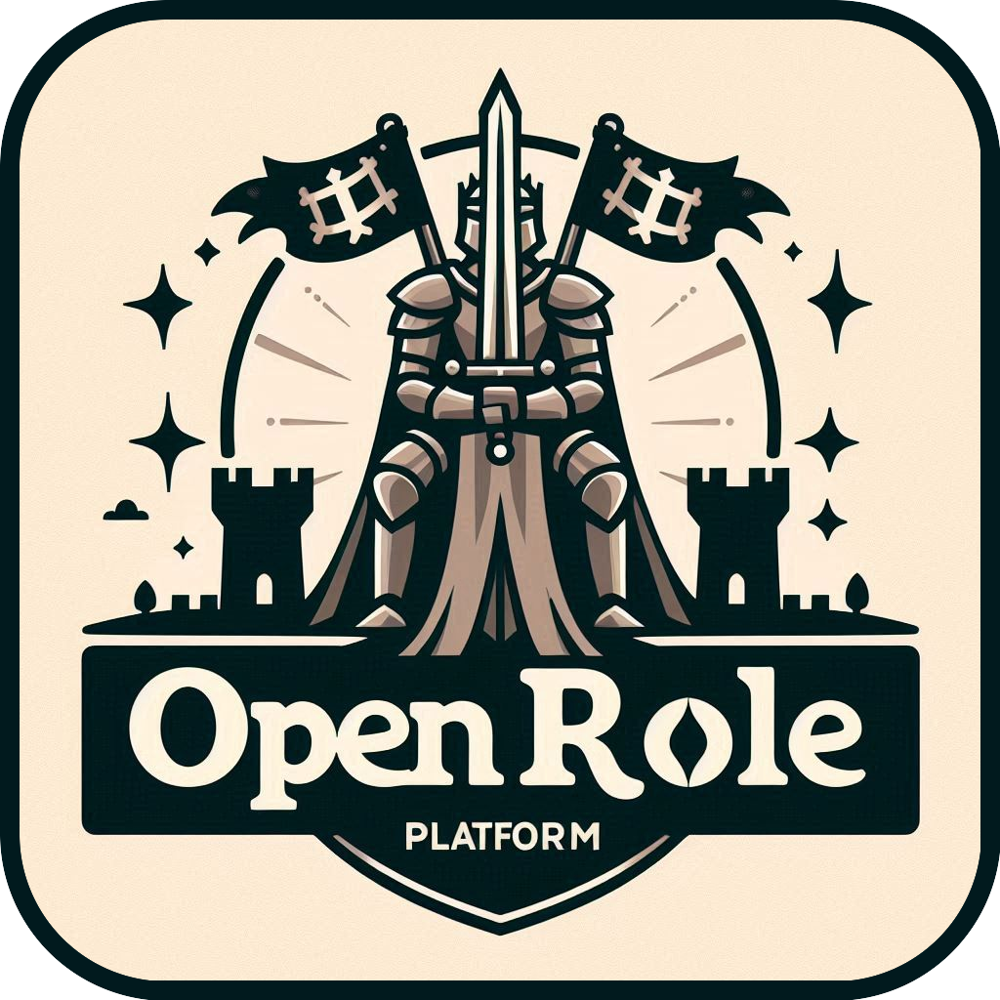

<p align="center">
  
  <h1 align="center">Open Role Platform</h1>
  <p align="center">
    Free open source support app for role playing games
  </p>
</p>
<br />

# Introduction

Open Role Platform is a small open source project that serves as as support tool for your role sessions.

This tool provides you with the following features:

- Campaing selector and campaign editor
- Character creation and character editor
- Inventory and equipment management
- Real time updates
- Different views for the master and the players
- Computer, tablet and mobile devices display support
- Locally hosted
- Capable to run inside a container
- Easy to use
- Light and dark theme
- Flexibility to modify the source code to your liking
- Totally free :)

# Development

This project has two clearly divided sections; frontend and backend.

## Frontend

Our frontend uses [React.js](https://react.dev/) as the main development framework with [Vite](https://vite.dev/) as a support development tool.
We also used [Ant Design](https://ant.design/) as our primary component library.

## Backend

### API

Our backend is primarly developed using [Node.js](https://nodejs.org/) with the addition of [Nodemon](https://www.npmjs.com/package/nodemon) as a helper tool.

### Database

The databse used in this project is [MongoDB](https://www.mongodb.com/).

### Real time updates

To achieve the real time updates inside the application we set a [WebSocket](https://datatracker.ietf.org/doc/html/rfc6455) server that manages the client connections and calls for the necessary values to update on each broadcast.

# Start up the application

This application is meant to run in a local system, which means that is prepared to run in a machine which is located in the same private network as the rest of devices that will acces the resources.

## Run in development mode

To run in development mode will be necessary have pre-installed `Node >= v20.11.1` and `npm >= v10.2.4` and `mongodb >= v8.0`.

Install depencencies for backend:

```bash
cd backend
```

```bash
npm install
```

Install depencencies for frontend:

```bash
cd frontend
```

```bash
npm install
```

Run databse:

```bash
sudo systemctl start mongod.service
```

Run backend:

```bash
cd backend
```

```bash
npm start
```

Run frontend:

```bash
cd frontend
```

```bash
npm start
```

## Run inside a container

To run the project inside a container will be necessary to have `Docker` and `docker compose` pre-installed. If your host server machine has a linux distribution installed, you can use the provided `get-docker.sh` script to automatize the docker installation:

```bash
cd scripts
```

```bash
sh get-docker.sh
```

Otherwise, the docker engine installation will be manually.

To start up the application:

```bash
docker compose up
```

Because of the high print output messages coming from the databse, it is recommended to run the containers in detach mode:

```bash
docker compose up -d
```

# Configuration

To configure the application there is a provided `.env` file with the environmental variables used to deploy the application in both development and container mode.

# License

As shown in the `LICENSE` file, this project is under the [GNU AFFERO GENERAL PUBLIC LICENSE](https://www.gnu.org/licenses/agpl-3.0.html).
